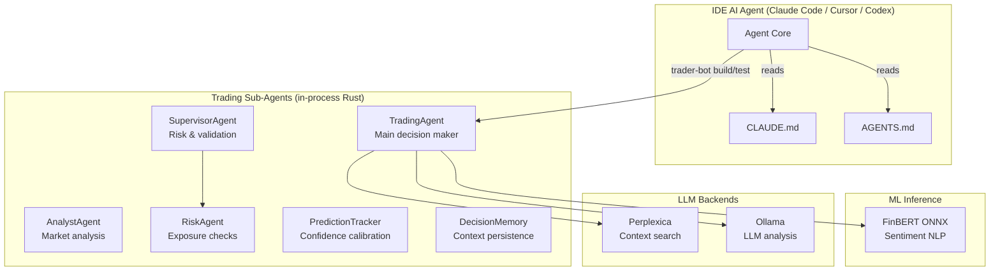
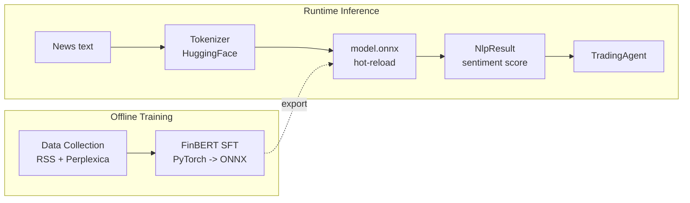

# Market Bot - Agents & Skills

## Architecture Overview



The system is structured as a multi-agent architecture with three layers:

- **IDE AI Agent** (Claude Code / Cursor / Codex) orchestrates development tasks
- **Trading Sub-Agents** (in-process Rust) form the runtime decision pipeline: AnalystAgent collects signals, SupervisorAgent validates risk, TradingAgent executes decisions
- **ML Inference** runs the FinBERT ONNX model (news sentiment) loaded in-process with hot-reload support

Data flow: `WS OrderBook -> features -> ONNX FinBERT -> Decision Engine -> Risk -> Execution`

```
ai-trade-bot/
├── trader-bot/                  # Rust - trading core (workspace member)
│   ├── src/
│   │   ├── main.rs              # Entry point, wires everything
│   │   ├── lib.rs               # Library root (mods + re-exports)
│   │   ├── core/                # Broker-agnostic types & traits (Decimal money)
│   │   ├── agent/               # TradingAgent, AnalystAgent, SupervisorAgent, RiskAgent
│   │   ├── provider/prediction/ # Technical/Llm/StatArb/Fundamental/FinBert predictors
│   │   ├── broker/              # Tinkoff, Mock, Finam implementations
│   │   ├── datasource/          # Tinkoff, Finam data sources
│   │   ├── ml_inference/        # ONNX (FinBERT NLP) with hot-reload
│   │   ├── strategy/            # Grid, Interval, Ai, StatArb, pairs, trading calendar
│   │   ├── execution/           # Position manager/tracker, risk gate, journal
│   │   ├── mcp/                 # Ollama + Perplexica LLM backends
│   │   ├── api/                 # Axum dashboard
│   │   └── config/              # Config loading (BrokerType enum)
│   └── config/account.json      # Broker credentials
├── training/
│   ├── finbert_sft/             # FinBERT SFT pipeline (PyTorch -> ONNX)
│   ├── data_collection/         # RSS + Perplexica -> Ollama labeling
│   └── pipeline.sh              # Full end-to-end training pipeline
├── models/finbert/              # ONNX artifacts (model.onnx, tokenizer.json)
├── scripts/download_model.sh    # Download pre-trained model from HF Hub
├── example/config/              # Account config example
└── docs/                        # MkDocs site source
```

## Project Setup

### Prerequisites

- **Rust** (edition 2024): install via `rustup`
- **Python 3.10+** for the training pipeline
- **Docker** (optional) for GPU-accelerated training or Ollama
- **Ollama** running locally (default: `http://localhost:11434`) for LLM-based analysis

### Clone and Build

```bash
git clone https://github.com/AlexWan/ai-trade-bot
cd ai-trade-bot

# Build the Rust workspace
cargo build -p trader-bot
```

### Python Dependencies (Training)

```bash
pip install -r training/requirements.txt
# Or editable install:
pip install -e training/
```

### Download the Pre-trained FinBERT Model

```bash
# Requires huggingface-cli (pip install huggingface_hub)
bash scripts/download_model.sh
```

This downloads the ONNX model + tokenizer from HuggingFace Hub to `models/finbert/`.

### Configure

Edit `trader-bot/config/account.json` with your broker credentials (Tinkoff API token, Finam credentials, etc.).

### Run

```bash
# Start the trading bot
RUST_LOG=info cargo run -p trader-bot

# Or with a specific config
RUST_LOG=debug cargo run -p trader-bot -- --config trader-bot/config/account.json
```

## Daily Workflow

### Build

```bash
# Build entire workspace
cargo build

# Build specific crate
cargo build -p trader-bot
```

### Test

```bash
# Run all tests
cargo test

# Run tests for a specific crate
cargo test -p trader-bot

# Run with output
cargo test -p trader-bot -- --nocapture
```

### Lint and Type Check

```bash
# Clippy (Rust linter)
cargo clippy -p trader-bot

# Python linting (training)
ruff check training/
```

### Run the Bot

```bash
# Development mode with verbose logging
RUST_LOG=info cargo run -p trader-bot

# Release build for production
cargo build --release -p trader-bot
./target/release/trader-bot
```

### Common Development Tasks

| Task | Command / Location |
|------|--------------------|
| Add a broker | Implement `Broker` trait in `trader-bot/src/broker/`, register in mod.rs |
| Add a strategy | Implement `Strategy` trait, register in `trader-bot/src/strategy/registry.rs` |
| Add a data source | Implement `DataSource` trait in `trader-bot/src/datasource/` |
| Update ONNX model | Replace `models/finbert/model.onnx` (auto hot-reload) |
| Add dashboard route | Add handler in `trader-bot/src/api/routes/` |
| Run data collection | `python training/data_collection/collect.py --merge` |
| Run training | `python training/finbert_sft/train.py` |
| Export ONNX | `python training/finbert_sft/export_onnx.py` |

## Available Skills

Skills are provided via IDE plugins - none are bundled inside this repository.

### finam-skill (external)

**Repo:** https://github.com/FinamWeb/finam-skill

```bash
# Install in Claude Code
claude plugin marketplace add FinamWeb/finam-skill
claude plugin install finam@finam-skill --scope user

# Install in Cursor
/add-plugin https://github.com/FinamWeb/finam-skill
```

**What it provides:** direct access to Finam Trade API from the IDE - quotes, order book, portfolio, orders, instrument search, and algorithmic trading scripts.

## Sub-Agents (Rust, in-process)

### TradingAgent

Main decision-making agent. Collects signals from AnalystAgent, validates through SupervisorAgent, and executes through the Execution layer.

```rust
// trader-bot/src/agent/trading_agent.rs
pub struct TradingAgent {
    llm_query: Box<dyn LlmQuery>,
    /// Dual persistence: RAM + flash (JSON file)
    pub memory: Arc<RwLock<DecisionMemory>>,
}

impl TradingAgent {
    pub async fn make_decision(&self, ctx: DecisionContext) -> TradingDecision;
    pub async fn make_rule_based_decision(&self, ctx: DecisionContext) -> TradingDecision;
}
```

Two decision modes:
- **LLM-based** (`make_decision`): builds a prompt from context (news sentiment, technical analysis, fundamentals, portfolio state), queries Ollama, and parses the JSON response into a `TradingDecision`
- **Rule-based** (`make_rule_based_decision`): applies deterministic rules without an LLM call - suitable for fast, low-latency decisions

### AnalystAgent

Collects and analyzes multiple signal sources:

```rust
pub struct AnalystAgent {
    ensemble: EnsemblePredictor,
    memory: DecisionMemory,
}
```

Uses an ensemble of predictors:
- **TechnicalPredictor** - RSI, MACD, Bollinger Bands, volume analysis
- **LlmPredictor** - Ollama-based fundamental/news reasoning
- **StatArbPredictor** - statistical arbitrage signals
- **FundamentalPredictor** - P/E, ROE, D/E, revenue growth
- **FinBertPredictor** - FinBERT news sentiment

The ensemble produces a weighted `AnalystProposal` with action, confidence, and conviction score.

### SupervisorAgent

Combines analysis with risk validation:

```rust
pub struct SupervisorAgent {
    analyst: AnalystAgent,
    risk: RiskAgent,
}
```

Flow: `AnalystAgent.analyze(ctx) -> proposal` then `RiskAgent.assess(proposal, ctx) -> risk_assessment`. If risk score exceeds threshold, action is overridden to `Hold`.

### RiskAgent

Validates signals before execution:

- Max loss / drawdown limits
- Position sizing relative to available balance
- Market regime awareness (volatile/trending/quiet)
- RSI-based volatility assessment
- Historical win-rate weighting
- Open positions limit

### DecisionMemory

Persists all decisions and their outcomes. Used for:

- Few-shot examples in LLM prompts
- Confidence calibration (PredictionTracker)
- Historical error analysis
- Win-rate tracking per provider

```rust
// trader-bot/src/agent/memory.rs
pub struct DecisionMemory {
    records: VecDeque<DecisionRecord>,
    max_records: usize,
}
```

Tracks for each record: ticker, action, conviction, entry/exit price, PnL, provider name, success flag.

### PredictionTracker (calibration)

Confidence score calibration on historical data. Corrects overconfidence/underconfidence bias via Platt scaling.

```rust
// trader-bot/src/agent/calibration.rs
pub struct PredictionTracker {
    provider_results: HashMap<String, ProviderStats>,
    calibration_bins: Vec<CalibrationBin>,  // 10 bins from 0.0 to 1.0
    recent_predictions: Vec<PredictionRecord>,
}
```

Computes Expected Calibration Error (ECE) to measure and correct miscalibration.

## ML Pipeline (Agent-integrated)



### FinBERT Inference

```rust
// trader-bot/src/ml_inference/nlp.rs
let nlp = FinBertInference::new("models/finbert")?;
let result: NlpResult = nlp.predict("company reported 30% revenue growth")?;
// { label: "positive", confidence: 0.97, scores: [-2.3, 0.1, 4.2] }

// TradingAgent uses:
let sentiment = result.sentiment_score(); // 0.97
```

**Hot-reload:** the ONNX session watches `model.onnx` for changes via `notify` and reloads automatically - no process restart needed.

**Thread safety:** ONNX inference runs on `spawn_blocking` to avoid blocking the tokio runtime.

## Model Fine-Tuning Pipeline

The complete pipeline for collecting financial news, labeling via LLM, fine-tuning FinBERT, and exporting to ONNX.

### Step 1: Data Collection

Collect financial news from RSS feeds and Perplexica context search, then label via Ollama LLM.

```bash
# Collect and label data (RSS + Perplexica -> Ollama labeling)
python training/data_collection/collect.py

# Merge collected data into a training dataset
python training/data_collection/collect.py --merge
```

Configuration in `training/data_collection/config.yaml`:
- RSS feeds: Interfax, CBR, Vedomosti, TASS, Prime, Banki, SmartLab, Finmarket, RBC
- Perplexica topics for context search (market news, sector-specific queries)
- Ollama model for labeling (default: `fin-expert`)
- Output directory: `training/data_collected/`

For Sberbank-specific collection (included in the full pipeline):

```bash
python training/data_collection/sber_collect.py --days 7
python training/data_collection/sber_collect.py --merge
```

### Step 2: Train FinBERT SFT

Fine-tune the `ProsusAI/finbert` model on the collected financial dataset.

```bash
python training/finbert_sft/train.py
```

Training configuration in `training/finbert_sft/config.yaml`:

| Parameter | Value |
|-----------|-------|
| Base model | `ProsusAI/finbert` |
| Labels | `negative`, `neutral`, `positive` |
| Sequence length | 128 tokens |
| Batch size | 16 |
| Epochs | 4 |
| Learning rate | 2e-5 |
| Weight decay | 0.01 |
| Output dir | `models/finbert/` |

### Step 3: Evaluate

```bash
python training/finbert_sft/evaluate.py
```

### Step 4: Export to ONNX

Export the fine-tuned PyTorch model to ONNX format for in-process inference in Rust.

```bash
python training/finbert_sft/export_onnx.py
```

Output: `models/finbert/model.onnx`

### Step 5: Test Inference

Run the Rust binary to verify the exported model loads and produces correct inference:

```bash
RUST_LOG=info cargo run -p trader-bot
```

The ONNX model is hot-reloaded automatically - just replace `models/finbert/model.onnx` and the bot picks it up without restart.

### Full Pipeline (Docker GPU)

For end-to-end automated pipeline with GPU acceleration:

```bash
# Build the Docker image
docker build -t finbert-sft:latest -f training/finbert_sft/Dockerfile .

# Run the full pipeline
HF_TOKEN=hf_xxx bash training/pipeline.sh --days 30
```

The pipeline script (`training/pipeline.sh`) runs:
1. `sber_collect.py --days N` - collect Sberbank news
2. `sber_collect.py --merge` - merge into training set
3. `train.py` - FinBERT SFT fine-tuning
4. `evaluate.py` - model evaluation
5. `export_onnx.py` - export to ONNX

## Agent Conventions

| Convention | Rule |
|-----------|------|
| **Naming** | `PascalCase` for agents and types, `snake_case` for methods and variables |
| **Async** | All agent methods are `async fn` using tokio |
| **Errors** | `anyhow::Result` everywhere |
| **State** | `Arc<RwLock<...>>` for shared mutable state |
| **ML inference** | `spawn_blocking` for ONNX (do not block tokio runtime) |
| **Edition** | Rust edition 2024 |
| **Broker trait** | `crate::core::traits::Broker` |
| **Config** | `trader-bot/config/account.json` loaded via serde JSON |
| **Money** | `Decimal` (rust_decimal) on broker-facing order/portfolio fields; `f64` for market data & analysis |
