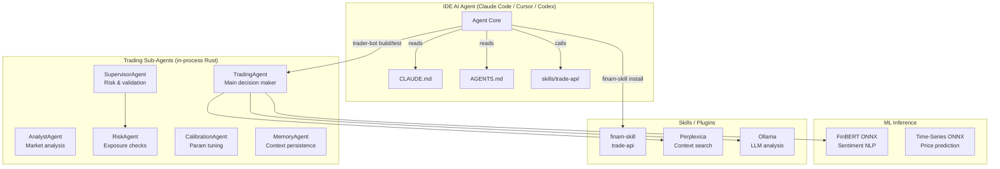
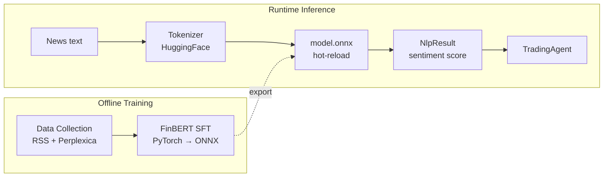

# AI Trade Bot — Agents & Skills

## Agent System Overview



## Available Skills

### trade-api (built-in)

**Location:** `skills/trade-api/SKILL.md`

Commands available to IDE agents:

| Command | Description |
|---------|-------------|
| `analyze` | Deep portfolio analysis with FinBERT sentiment |
| `scan` | Market scanner — find instruments by volatility/volume/momentum |
| `backtest` | Run strategy backtest with parameter ranges |
| `train` | Run FinBERT SFT training pipeline |

```bash
# В Claude Code:
/ai-trade-bot:scan
# Найти акции Мосбиржи с объёмом >500млн и ростом >5% за неделю

# В Cursor:
/ai-trade-bot:analyze
# Проанализируй портфель, покажи риски
```

### finam-skill (external)

**Repo:** https://github.com/FinamWeb/finam-skill

```bash
# Установка в Claude Code
claude plugin marketplace add FinamWeb/finam-skill
claude plugin install finam@finam-skill --scope user

# Установка в Cursor
/add-plugin https://github.com/FinamWeb/finam-skill
```

**Что даёт:** прямой доступ к Finam Trade API из IDE — котировки, стакан, портфель, ордера, поиск инструментов, скрипты для алготорговли.

## Sub-Agents (Rust, in-process)

### TradingAgent
Главный агент принятия решений. Собирает сигналы от AnalystAgent, проверяет через SupervisorAgent, исполняет через Execution.

```rust
// trader-bot/src/agent/trading_agent.rs
pub struct TradingAgent {
    llm: OllamaProvider,
    memory: DecisionMemory,
    analyst: AnalystAgent,
    supervisor: SupervisorAgent,
    calibrator: CalibrationAgent,
}

impl TradingAgent {
    pub async fn make_decision(&self, ctx: DecisionContext) -> TradingDecision;
    pub async fn make_rule_based_decision(&self, ctx: DecisionContext) -> TradingDecision;
}
```

### AnalystAgent
Собирает и анализирует:
- Технические индикаторы (RSI, MACD, Bollinger)
- Новостной сентимент (FinBERT ONNX + Ollama)
- Фундаментальные метрики (P/E, ROE, рост)
- Режим рынка (MarketRegime)

### RiskAgent
Проверяет сигналы перед исполнением:
- Max loss / drawdown limits
- Position sizing от баланса
- Correlation risk между инструментами
- Open positions limit

### MemoryAgent
Сохраняет все решения и их результаты в DecisionMemory. Используется для:
- Few-shot примеров в LLM-промптах
- Калибровки уверенности (CalibrationAgent)
- Анализа исторических ошибок

### CalibrationAgent
Калибровка confidence-скорогов на исторических данных. Исправляет смещение (overconfidence/underconfidence) через Platt scaling.

## ML Pipeline (Agent-integrated)



### FinBERT Inference

```rust
// trader-bot/src/ml_inference/nlp.rs
let nlp = FinBertInference::new("models/finbert")?;
let result: NlpResult = nlp.predict("компания показала рост выручки 30%")?;
// { label: "positive", confidence: 0.97, scores: [-2.3, 0.1, 4.2] }

// TradingAgent uses:
let sentiment = result.sentiment_score(); // 0.97
```

### Training Pipeline

```bash
# 1. Сбор данных
python training/data_collection/collect.py --merge

# 2. SFT дообучение
python training/finbert_sft/train.py

# 3. Экспорт в ONNX (авто-релоад в Rust)
python training/finbert_sft/export_onnx.py
```

## Agent Conventions

| Convention | Rule |
|-----------|------|
| **Naming** | `PascalCase` для агентов, `snake_case` для методов |
| **Async** | Все методы агентов — `async fn` |
| **Errors** | `anyhow::Result` |
| **State** | `Arc<RwLock<...>>` для shared state |
| **ML** | `spawn_blocking` для ONNX (не блокировать tokio) |

## Plugin Manifests

| Platform | File |
|----------|------|
| Claude Code | `.claude-plugin/plugin.json` |
| Cursor | `.cursor-plugin/plugin.json` |
| Codex | `.codex-plugin/plugin.json` |
| Marketplace registry | `.agents/plugins/marketplace.json` |
