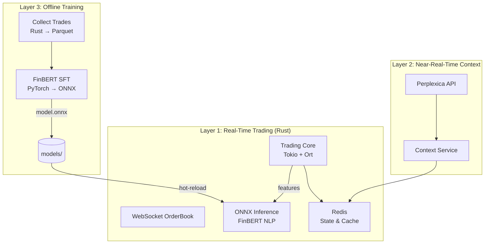

# Market Bot — Комплексная торговая система

[](https://www.rust-lang.org)
[](https://opensource.org/licenses/MIT)

AI-powered торговая система для торговли на Московской бирже через Tinkoff Invest API. Система сочетает технический анализ, анализ новостей с LLM и фундаментальный анализ для принятия торговых решений.

## 📋 Оглавление

- [Возможности](#возможности)
- [Архитектура](#архитектура)
- [Быстрый старт](#быстрый-старт)
- [Конфигурация](#конфигурация)
- [Торговые стратегии](#торговые-стратегии)
- [API и интеграции](#api-и-интеграции)
- [Примеры использования](#примеры-использования)
- [Troubleshooting](#troubleshooting)

## 🚀 Возможности

### AI-анализ рынка
- **Технический анализ**: RSI, MACD, Bollinger Bands, уровни поддержки/сопротивления
- **Новостной анализ**: LLM-анализ тональности новостей (Ollama/Finance-Llama-8B)
- **Фундаментальный анализ**: P/E, ROE, D/E, рост выручки и прибыли

### Торговые стратегии
- **Interval Strategy**: Торговля на основе временных интервалов
- **Grid Bot**: Сеточная торговля в боковом тренде
- **Momentum**: Торговля по тренду
- **Mean Reversion**: Возврат к среднему

### Управление рисками
- Расчет размера позиции от баланса
- Stop Loss и Take Profit уровни
- Ограничения на максимальную позицию
- Резервирование баланса

### Интеграции
- **Tinkoff Invest API**: Торги на Московской бирже
- **Ollama LLM**: Локальная языковая модель для анализа
- **DuckDuckGo**: Поиск новостей
- **Perplexica**: AI-поисковик для анализа компаний и новостей

## 🏗 Архитектура

```
ai-trade-bot/
├── trader-bot/             # Основной торговый бот (Rust)
│   ├── src/
│   │   ├── main.rs         # Точка входа
│   │   ├── core/           # Broker-agnostic types & traits
│   │   ├── broker/         # Broker impls (Tinkoff, Mock, Finam)
│   │   ├── datasource/     # Data sources (Tinkoff, Finam)
│   │   ├── ml_inference/   # ONNX inference (FinBERT NLP, Time-Series)
│   │   ├── strategy/       # Trading strategies (Grid, Interval, etc.)
│   │   ├── execution/      # Order execution
│   │   ├── client/         # API clients
│   │   ├── config/         # Configuration
│   │   └── api/            # Dashboard (Axum)
│   └── config/             # Config files
├── mcp-client/             # MCP client for LLM (Ollama)
├── training/               # ML training pipeline
│   └── finbert_sft/        # FinBERT SFT (Supervised Fine-Tuning)
├── models/                 # ONNX model artifacts
│   └── finbert/            # FinBERT ONNX model
└── ollama/                 # Docker container with Ollama + fin-expert
```

### Data Flow



## ⚡ Быстрый старт

### 1. Требования

- Rust 1.70+
- Docker (для Ollama)
- Tinkoff Invest токен

### 2. Установка токена

Получите токен: https://www.tbank.ru/invest/settings/

```bash
# Вариант 1: В конфиге
# Отредактируйте trader-bot/config/account.json
{
  "creditional": {
    "token": "YOUR_TOKEN_HERE"
  }
}

# Вариант 2: Переменная окружения
export API_TOKEN="YOUR_TOKEN_HERE"
```

### 3. Запуск Ollama (опционально, для LLM-анализа)

```bash
docker compose up -d ollama
```

### 4. Запуск бота

```bash
# Сборка
cargo build -p trader-bot

# Запуск в sandbox режиме
cargo run -p trader-bot

# Запуск с логированием
RUST_LOG=info cargo run -p trader-bot
```

## ⚙️ Конфигурация

### Структура config/account.json

```json
{
  "type": "trading",
  "creditional": { "token": "..." },
  "accounts": [
    {
      "account_id": "main",
      "instruments": [
        {
          "figi": "TQBR",
          "ticker": "TTECH",
          "name": "Т-Технологии",
          "enabled": true,
          "max_position_pct": 0.15,
          "analysis_config": {
            "check_news": true,
            "technical_analysis": true,
            "fundamental_analysis": true
          }
        }
      ],
      "strategy": {
        "strategy": "interval",
        "parameters": {
          "interval_size": "1h",
          "days_back_to_consider": 30,
          "check_interval": 60
        }
      },
      "risk_management": {
        "max_loss_pct": 0.05,
        "take_profit_pct": 0.10,
        "stop_loss_pct": 0.03
      }
    }
  ],
  "mode": "sandbox",
  "llm_config": {
    "model": "fin-expert",
    "host": "http://localhost",
    "port": 11435
  }
}
```

### Параметры конфигурации

| Параметр | Тип | Описание |
|----------|-----|----------|
| `mode` | string | "sandbox" или "prod" |
| `strategy.strategy` | string | Тип стратегии |
| `risk_management.max_loss_pct` | f64 | Макс. потеря от баланса |
| `llm_config.model` | string | Модель для LLM-анализа |

## 📈 Торговые стратегии

### 1. Grid Bot (Сеточная торговля)

Автоматически размещает ордера по ценовой сетке. Эффективен на флэте.

```json
{
  "strategy": "grid",
  "parameters": {
    "grid_config": {
      "lower_price": 250.0,
      "upper_price": 300.0,
      "grid_levels": 11,
      "order_size": 10,
      "grid_ratio": 0.5
    }
  }
}
```

📖 **Подробная документация**: [GRID_BOT.md](./GRID_BOT.md)

### 2. Interval Strategy

Торговля на основе технического анализа и новостного фона.

```json
{
  "strategy": "interval",
  "parameters": {
    "interval_size": "1h",
    "days_back_to_consider": 30,
    "check_interval": 60
  }
}
```

### 3. Momentum

Торговля по тренду с использованием LLM для подтверждения.

### 4. Mean Reversion

Возврат к среднему с использованием Bollinger Bands.

## 🔌 API и интеграции

### Tinkoff Invest API

- Market Data: Получение котировок и свечей
- Orders: Размещение и отмена заявок
- Portfolio: Мониторинг позиций и баланса
- Instruments: Поиск инструментов по FIGI/тикеру

### Ollama LLM

- Модель: `fin-expert` (на базе Finance-Llama-8B)
- Анализ новостей
- Принятие торговых решений
- Порт: 11435

### Perplexica

AI-поисковая система для глубокого анализа компаний и рынка.

- Поиск информации о компаниях
- Анализ новостей и аналитики
- Поиск рейтингов и целевых цен
- Порт: 3000

📖 **Документация**: [docs/PERPLEXICA.md](./docs/PERPLEXICA.md)

### FinBERT SFT (Supervised Fine-Tuning)

[FinBERT](https://huggingface.co/ProsusAI/finbert) — BERT, дообученный на финансовых текстах (SEC filings, earnings reports). Используется для **анализа тональности** новостей и макро-контекста.

**Pайплайн дообучения (`training/finbert_sft/`):**

| Этап | Скрипт | Описание |
|------|--------|----------|
| Dataset | `dataset.py` | Financial PhraseBank (3 класса: positive/neutral/negative) |
| Training | `train.py` | SFT с HuggingFace Trainer, early stopping, eval по F1 |
| Evaluation | `evaluate.py` | Classification report, confusion matrix |
| Export | `export_onnx.py` | Экспорт в ONNX с dynamic axes для batch/sequence |

**Инференс в Rust (`trader-bot/src/ml_inference/`):**

- `session.rs` — ORT session pool с hot-reload (notify)
- `nlp.rs` — FinBERT tokenizer + inference + softmax

```rust
let nlp = FinBertInference::new("models/finbert")?;
let result = nlp.predict("компания показала рост выручки на 30%")?;
// NlpResult { label: "positive", confidence: 0.97, scores: [...] }
```

**Запуск дообучения:**
```bash
pip install -r training/requirements.txt
python training/finbert_sft/train.py    # Fine-tune FinBERT
python training/finbert_sft/evaluate.py # Оценка
python training/finbert_sft/export_onnx.py  # → models/finbert/model.onnx
```

### Анализ новостей

- Источники: Tinkoff, Investing.com, Bloomberg
- LLM-анализ тональности
- Выделение ключевых событий

## 📚 Примеры использования

### Пример 1: Запуск Grid бота для SBER

1. Создайте конфиг:

```json
{
  "account_id": "grid_sber",
  "strategy": {
    "strategy": "grid",
    "parameters": {
      "grid_config": {
        "lower_price": 250.0,
        "upper_price": 300.0,
        "grid_levels": 11,
        "order_size": 10
      }
    }
  },
  "instruments": [{
    "figi": "BBG004730N88",
    "ticker": "SBER",
    "enabled": true
  }]
}
```

2. Запустите бота:
```bash
cargo run -p trader-bot
```

### Пример 2: AI-анализ с LLM

```bash
# Запуск с LLM-анализом новостей
RUST_LOG=info cargo run -p trader-bot

# Логи:
# [INFO] LLM-анализ: Positive (score: 0.65, confidence: 0.82)
# [INFO] Резюме: Позитивный новостной фон...
```

### Пример 3: Параллельная работа стратегий

```json
{
  "accounts": [
    {
      "account_id": "main",
      "strategy": { "strategy": "interval" },
      "instruments": [{"ticker": "TTECH", "enabled": true}]
    },
    {
      "account_id": "grid",
      "strategy": { "strategy": "grid" },
      "instruments": [{"ticker": "SBER", "enabled": true}]
    }
  ]
}
```

## 🔧 Troubleshooting

### Ошибка: "Инструмент не найден"

```
Error: Инструмент не найден: TTECH
```

**Решение:**
- Проверьте FIGI в конфигурации
- Убедитесь, что инструмент доступен для торговли

### Ошибка: "Недостаточно средств"

```
Error: Недостаточно средств для ордера
```

**Решение:**
- Увеличьте `min_balance_reserve`
- Уменьшите `order_size`
- Проверьте баланс в личном кабинете

### Ошибка подключения к Ollama

```
Error: Connection refused (os error 111)
```

**Решение:**
```bash
# Проверьте, запущен ли Ollama
docker ps | grep ollama

# Запустите Ollama
docker compose up -d ollama
```

### Бот не размещает ордера

**Возможные причины:**
1. Низкая уверенность сигнала (< 0.6)
2. Превышен лимит позиций
3. Недостаточный баланс

**Решение:**
- Проверьте логи на уровень confidence
- Увеличьте `max_open_positions`
- Проверьте доступный баланс

## 📊 Мониторинг и логи

### Уровни логирования

```bash
# Только ошибки
RUST_LOG=error cargo run -p trader-bot

# Информация (рекомендуется)
RUST_LOG=info cargo run -p trader-bot

# Подробные логи
RUST_LOG=debug cargo run -p trader-bot
```

### Ключевые события в логах

```
[INFO] Запуск Grid бота для SBER
[INFO] Grid сетка инициализирована, размещено ордеров: 10
[INFO] Ордер размещен: уровень=0, цена=250.00, сторона=Buy
[INFO] Сетка перебалансирована: отменено=2, размещено=3
[WARN] Риск: Высокая волатильность
[ERROR] Ошибка исполнения: Недостаточно средств
```

## 📝 Лицензия

MIT License — см. файл [LICENSE](./LICENSE)

## 🔗 Ссылки

- [Tinkoff Invest API](https://developer.tbank.ru/invest/intro/intro)
- [Документация Grid Bot](./GRID_BOT.md)
- [Ollama Documentation](https://ollama.ai)
- [Perplexica Documentation](./docs/PERPLEXICA.md)
- [Perplexica GitHub](https://github.com/ItzCrazyKns/Perplexica)

## 🤝 Вклад в проект

1. Fork репозитория
2. Создайте feature branch
3. Внесите изменения
4. Отправьте PR

## 📧 Контакты

Вопросы и предложения: создайте issue в репозитории.
