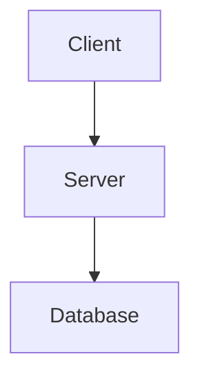

# Документация AI Trade Bot

Эта директория содержит исходный код документации проекта AI Trade Bot.

## Быстрый старт

### Локальная разработка

```bash
# Установка зависимостей
pip install -r docs/requirements.txt

# Запуск локального сервера
mkdocs serve

# Открыть в браузере
# http://127.0.0.1:8000/
```

### Сборка статической версии

```bash
# Сборка
mkdocs build

# Результат в папке site/
ls site/
```

## Структура документации

```
docs/
├── index.md                    # Главная страница
├── requirements.txt            # Python зависимости
├── getting-started/
│   ├── what-is.md             # Что такое AI Trade Bot
│   └── quickstart.md          # Быстрый старт
├── user-guide/
│   ├── introduction.md         # Введение
│   ├── configuration.md        # Конфигурация
│   ├── strategies.md           # Стратегии
│   ├── risk-management.md      # Управление рисками
│   └── monitoring.md           # Мониторинг
├── strategies/
│   ├── grid-bot.md            # Grid бот
│   ├── interval.md            # Interval стратегия
│   ├── momentum.md            # Momentum стратегия
│   └── mean-reversion.md      # Mean Reversion
├── developer-guide/
│   ├── architecture.md         # Архитектура
│   ├── api.md                  # API документация
│   ├── contributing.md         # Вклад в проект
│   └── changelog.md            # Changelog
├── assets/                     # Изображения, логотипы
├── stylesheets/               # Дополнительные CSS
└── javascripts/               # Дополнительные JS
```

## Деплой на GitLab Pages

### Автоматический деплой

Документация автоматически деплоится при пуше в ветку `main`:

```yaml
# .gitlab-ci.yml
pages:
  stage: deploy
  script:
    - pip install -r docs/requirements.txt
    - mkdocs build --clean --site-dir public
```

### Ручной деплой

```bash
# Установка mike для версионирования
pip install mike

# Деплой версии
mike deploy 0.2.0

# Отправка на сервер
mike deploy --push 0.2.0
```

### Проверка перед деплоем

```bash
# Строгая сборка (ошибки прерывают сборку)
mkdocs build --strict

# Проверка ссылок
mkdocs build --clean
```

## Темы и оформление

### Переключение темы

Документация использует Material for MkDocs с поддержкой светлой/темной темы.

### Кастомизация

Для изменения стилей отредактируйте:
- `docs/stylesheets/extra.css`

Для изменения конфигурации:
- `mkdocs.yml`

## Добавление новых страниц

1. Создайте файл в соответствующей директории:
```bash
touch docs/user-guide/new-page.md
```

2. Добавьте навигацию в `mkdocs.yml`:
```yaml
nav:
  - User Guide:
    - New Page: user-guide/new-page.md
```

3. Проверьте локально:
```bash
mkdocs serve
```

## Диаграммы Mermaid

Документация поддерживает диаграммы Mermaid:

````markdown

````

## Версионирование

Документация использует mike для версионирования:

```bash
# Список версий
mike list

# Деплой новой версии
mike deploy 0.3.0

# Установка версии по умолчанию
mike set-default 0.3.0

# Отправка
mike deploy --push 0.3.0
```

## Troubleshooting

### Ошибка: "Config value 'theme': Unrecognised theme"

```bash
# Переустановите тему
pip uninstall mkdocs-material
pip install mkdocs-material
```

### Ошибка: "Plugin error"

```bash
# Установите все зависимости
pip install -r docs/requirements.txt
```

### Битые ссылки

```bash
# Проверка ссылок
mkdocs build --strict 2>&1 | grep "broken link"
```

## Лицензия

Документация распространяется под лицензией MIT.
