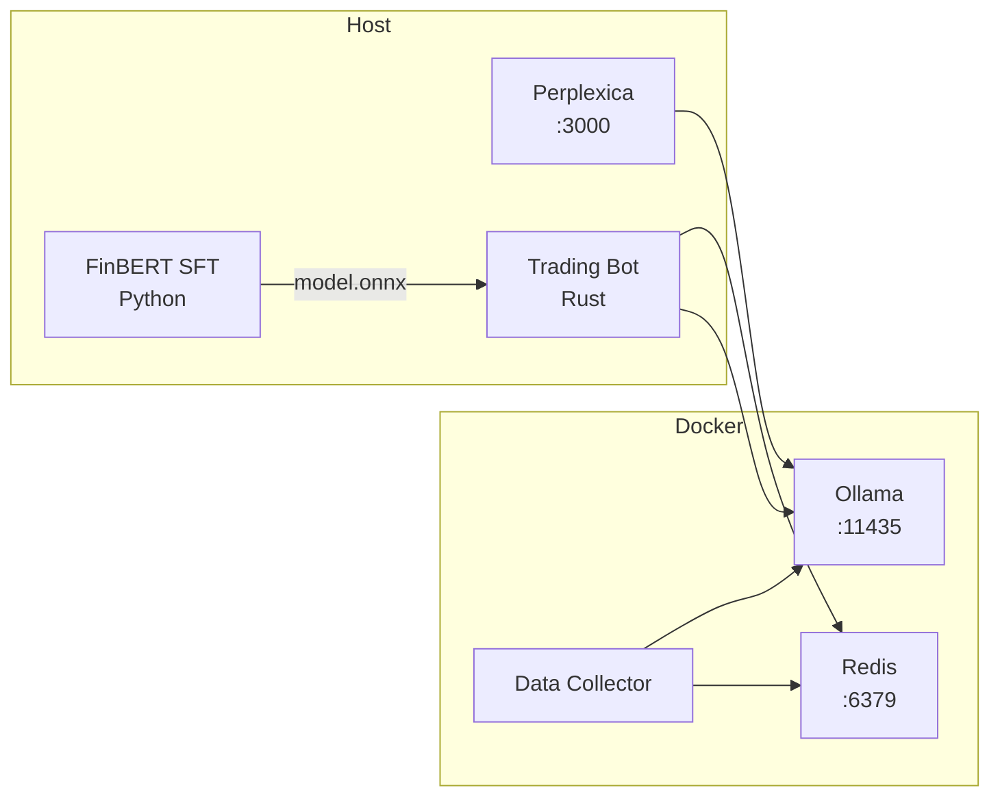

# Quick Start

Launch the full platform: Trading Core + LLM + Context + ML Training.

## 1. Requirements

| Component    | Version                   |
|--------------|---------------------------|
| Rust         | 1.70+                     |
| Docker       | 24+                       |
| Python       | 3.10+                     |
| NVIDIA Driver | 525+ (for GPU acceleration) |

## 2. Start Infrastructure (Layer 2)

```bash
docker compose up -d
```

| Service | Port | Purpose |
|---------|------|---------|
| Ollama | 11435 | LLM (fin-expert) for analysis |
| Redis | 6379 | Context cache, state |
| Data Collector | - | Background RSS news collection |

**Verify:**
```bash
curl http://localhost:11435/api/tags
# -> {"models":[{"name":"fin-expert:latest",...}]}

redis-cli ping
# -> PONG
```

## 3. Deploy Perplexica

```bash
git clone https://github.com/ItzCrazyKns/Perplexica.git
cd Perplexica
cp sample.config.toml config.toml
# edit config.toml: ollama endpoint = http://localhost:11435
docker compose up -d
# -> port 3000
```

**Verify:**
```bash
curl http://localhost:3000/api/search -d '{"query":"central bank key rate"}'
```

## 4. API Tokens

```bash
export TINKOFF_TOKEN="t.YOUR_TOKEN_HERE"
export FINAM_TOKEN="YOUR_SECRET_HERE"
```

Or via `trader-bot/config/account.json`:
```json
{
  "creditional": {
    "token": "t.YOUR_TINKOFF_TOKEN",
    "additional_keys": [{"broker": "finam", "api_key": "YOUR_FINAM_KEY"}]
  }
}
```

## 5. Collect Data for Fine-Tuning

```bash
# Install dependencies
pip install -r training/data_collection/requirements.txt

# One-time collection + labeling via Ollama
python training/data_collection/collect.py

# Or background mode (automatic every hour)
python training/data_collection/collect.py --watch

# Merge into training set
python training/data_collection/collect.py --merge
```

## 6. Fine-Tune FinBERT (SFT)

```bash
pip install -r training/requirements.txt

# Fine-tune on Financial PhraseBank + collected data
python training/finbert_sft/train.py

# Evaluate
python training/finbert_sft/evaluate.py

# Export to ONNX for Rust inference
python training/finbert_sft/export_onnx.py
# -> models/finbert/model.onnx
```

## 7. Run Trading Core

```bash
# Build
cargo build -p trader-bot

# Run
RUST_LOG=info cargo run -p trader-bot
```

**What happens:**
- FinBERT ONNX model loads -> news sentiment inference
- Perplexica -> macro context -> Redis -> Fusion with micro-signals
- Decision Engine -> Risk Check -> Execution

**Dashboard:** http://localhost:8080

## 8. Full Pipeline (Single Command)

```bash
# Infrastructure
docker compose up -d

# Data collection + training
pip install -r training/requirements.txt
pip install -r training/data_collection/requirements.txt
python training/data_collection/collect.py
python training/data_collection/collect.py --merge
python training/finbert_sft/train.py
python training/finbert_sft/export_onnx.py

# Trading
RUST_LOG=info cargo run -p trader-bot
```

## Running Process Structure



## Quick Verification

```bash
# 1) Redis
redis-cli get "perplexica:macro:latest"

# 2) Trading running
curl http://localhost:8080/api/health

# 3) Model loaded
ls -lh models/finbert/model.onnx
```
