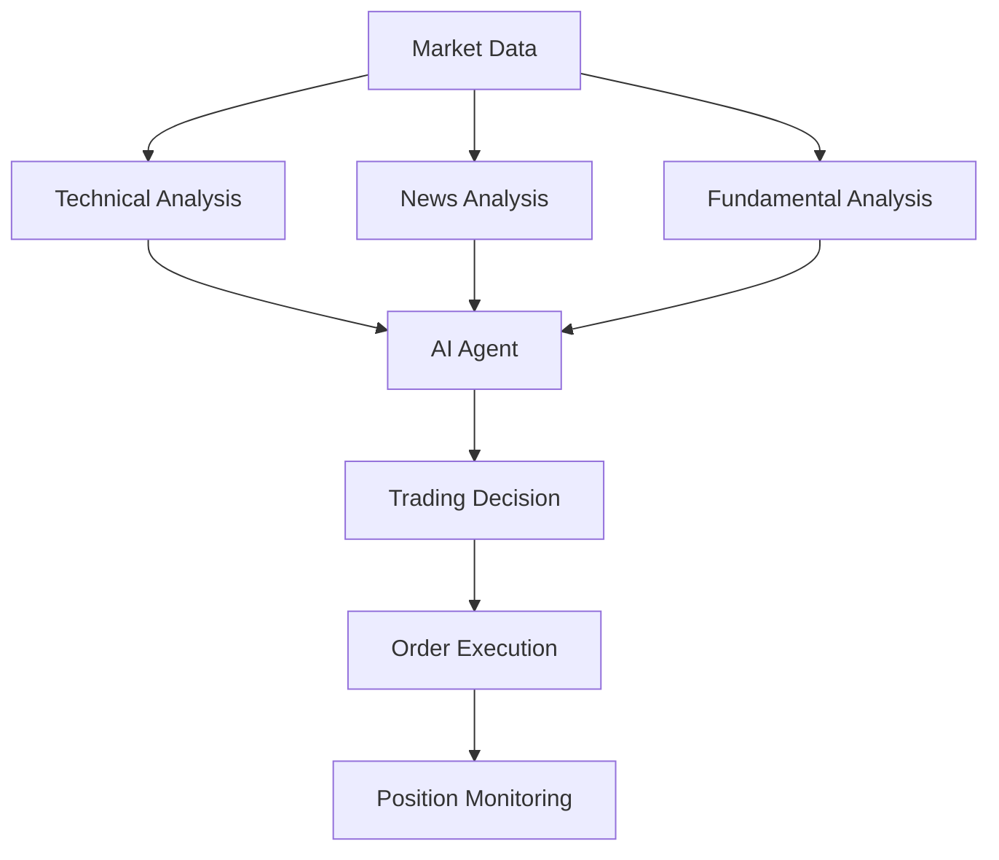

# What is AI Trade Bot?

AI Trade Bot is an automated trading system that uses artificial intelligence for market analysis and trading decisions.

## Key Features

### AI-Powered Market Analysis

The system combines three analysis types:

1. **Technical Analysis**
   - RSI (Relative Strength Index)
   - MACD (Moving Average Convergence Divergence)
   - Bollinger Bands
   - Support and resistance levels

2. **News Sentiment Analysis**
   - LLM-powered tone analysis (Ollama/qwen3)
   - Key event extraction
   - Risk and opportunity identification

3. **Fundamental Analysis**
   - Multipliers (P/E, P/B, EV/EBITDA)
   - Profitability (ROE, ROA, margins)
   - Financial health (D/E, Current Ratio)
   - Growth rates (revenue, profit)

### Trading Strategies

| Strategy | Description | When to Use |
|----------|-------------|-------------|
| **Grid** | Buy/sell order grid | Sideways trend (flat) |
| **Interval** | Time-interval trading | Any market conditions |
| **Momentum** | Trend following | Strong trend |
| **Mean Reversion** | Reversion to mean | After strong deviations |

### Risk Management

- Position sizing based on balance
- Stop Loss to limit losses
- Take Profit to lock in gains
- Maximum position limits
- Balance reserve

## How It Works



## Architecture

```
+-------------------------------------------------------+
|                  AI Trade Bot                          |
+-------------------------------------------------------+
|  +---------------+  +---------------+  +-------------+ |
|  |   Market      |  |   News        |  |  Fundamental| |
|  |   Data        |  |   Analyzer    |  |  Analyzer   | |
|  +-------+-------+  +-------+-------+  +------+------+ |
|          |                  |                  |        |
|          +------------------+------------------+        |
|                             |                           |
|                     +-------v--------+                  |
|                     |  Trading Agent |                  |
|                     |     (LLM)      |                  |
|                     +-------+--------+                  |
|                             |                           |
|            +----------------+----------------+          |
|            |                |                |          |
|     +------v------+  +------v------+  +-----v------+   |
|     |   Grid      |  |  Interval   |  | Momentum   |   |
|     |   Bot       |  |  Strategy   |  | Strategy   |   |
|     +------+------+  +------+------+  +-----+------+   |
|            |                |               |           |
|            +----------------+---------------+           |
|                             |                           |
|                     +-------v--------+                  |
|                     | Order Executor |                  |
|                     +-------+--------+                  |
|                             |                           |
|                     +-------v--------+                  |
|                     |  Tinkoff API   |                  |
|                     +----------------+                  |
+-------------------------------------------------------+
```

## Requirements

### Minimum

- Rust 1.70+
- 2 GB RAM
- 1 GB disk space
- Tinkoff Invest token

### Recommended

- Rust 1.75+
- 4 GB RAM
- Docker (for Ollama)
- GPU (for LLM acceleration)

## Next Steps

- **[Quick Start](quickstart.md)** — Installation and launch
- **[Configuration](../user-guide/configuration.md)** — Bot setup
