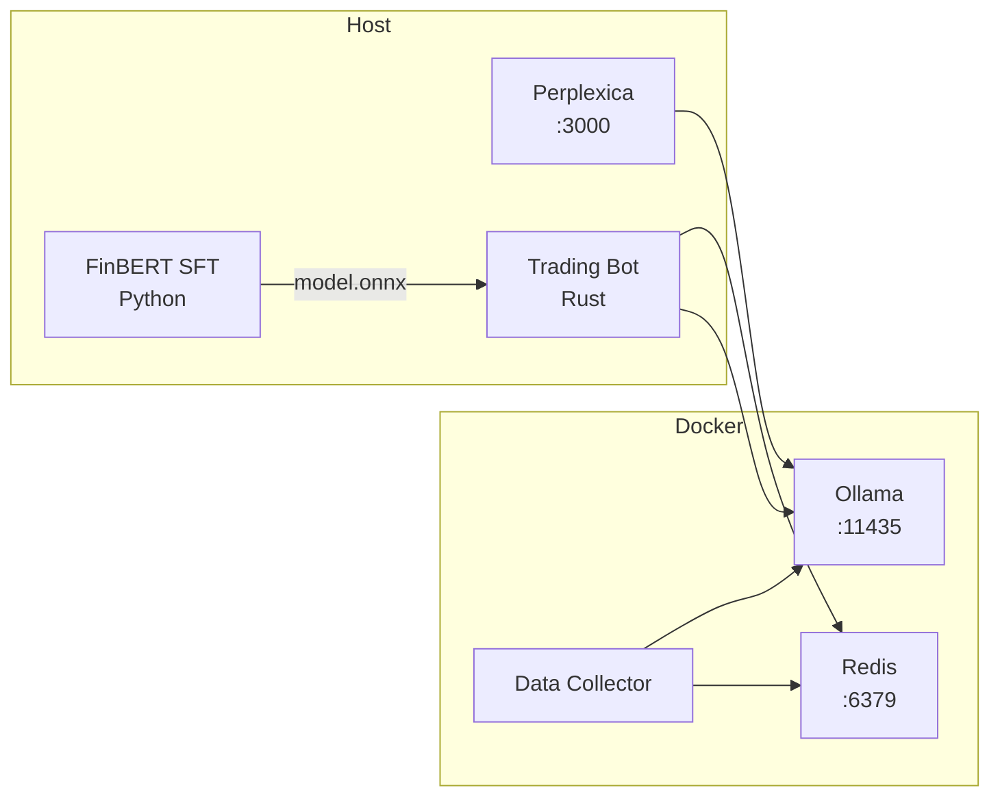

# Быстрый старт

Запуск полной платформы: Trading Core + LLM + Context + ML Training.

## 1. Требования

| Компонент     | Версия                   |
|---------------|--------------------------|
| Rust          | 1.70+                    |
| Docker        | 24+                      |
| Python        | 3.10+                    |
| NVIDIA Driver | 525+ (для GPU-ускорения) |

## 2. Запуск инфраструктуры (Layer 2)

```bash
docker compose up -d
```

| Сервис | Порт | Назначение |
|--------|------|------------|
| Ollama | 11435 | LLM (fin-expert) для анализа |
| Redis | 6379 | Кэш контекста, состояние |
| Data Collector | — | Фоновый сбор новостей RSS |

**Проверка:**
```bash
curl http://localhost:11435/api/tags
# → {"models":[{"name":"fin-expert:latest",...}]}

redis-cli ping
# → PONG
```

## 3. Развёртывание Perplexica

```bash
git clone https://github.com/ItzCrazyKns/Perplexica.git
cd Perplexica
cp sample.config.toml config.toml
# отредактируйте config.toml: ollama endpoint = http://localhost:11435
docker compose up -d
# → порт 3000
```

**Проверка:**
```bash
curl http://localhost:3000/api/search -d '{"query":"ключевая ставка ЦБ"}'
```

## 4. API токены

```bash
export TINKOFF_TOKEN="t.YOUR_TOKEN_HERE"
export FINAM_TOKEN="YOUR_SECRET_HERE"
```

Либо через файл `trader-bot/config/account.json`:
```json
{
  "creditional": {
    "token": "t.YOUR_TINKOFF_TOKEN",
    "additional_keys": [{"broker": "finam", "api_key": "YOUR_FINAM_KEY"}]
  }
}
```

## 5. Сбор данных для дообучения

```bash
# Установка зависимостей
pip install -r training/data_collection/requirements.txt

# Разовый сбор + разметка через Ollama
python training/data_collection/collect.py

# Или фоновый режим (автоматически каждый час)
python training/data_collection/collect.py --watch

# Смержить в тренировочный набор
python training/data_collection/collect.py --merge
```

## 6. Дообучение FinBERT (SFT)

```bash
pip install -r training/requirements.txt

# Fine-tune на Financial PhraseBank + собранные данные
python training/finbert_sft/train.py

# Оценка
python training/finbert_sft/evaluate.py

# Экспорт в ONNX для инференса в Rust
python training/finbert_sft/export_onnx.py
# → models/finbert/model.onnx
```

## 7. Запуск Trading Core

```bash
# Сборка
cargo build -p trader-bot

# Запуск
RUST_LOG=info cargo run -p trader-bot
```

**Что происходит:**
- Загрузка FinBERT ONNX модели → инференс тональности новостей
- Perplexica → макро-контекст → Redis → Fusion с микро-сигналами
- Decision Engine → Risk Check → Execution

**Дашборд:** http://localhost:8080

## 8. Полный пайплайн (одной командой)

```bash
# Инфраструктура
docker compose up -d

# Сбор данных + обучение
pip install -r training/requirements.txt
pip install -r training/data_collection/requirements.txt
python training/data_collection/collect.py
python training/data_collection/collect.py --merge
python training/finbert_sft/train.py
python training/finbert_sft/export_onnx.py

# Торговля
RUST_LOG=info cargo run -p trader-bot
```

## Структура запущенных процессов



## Быстрая проверка

```bash
# 1) Redis
redis-cli get "perplexica:macro:latest"

# 2) Трейдинг запущен
curl http://localhost:8080/api/health

# 3) Модель загружена
ls -lh models/finbert/model.onnx
```
