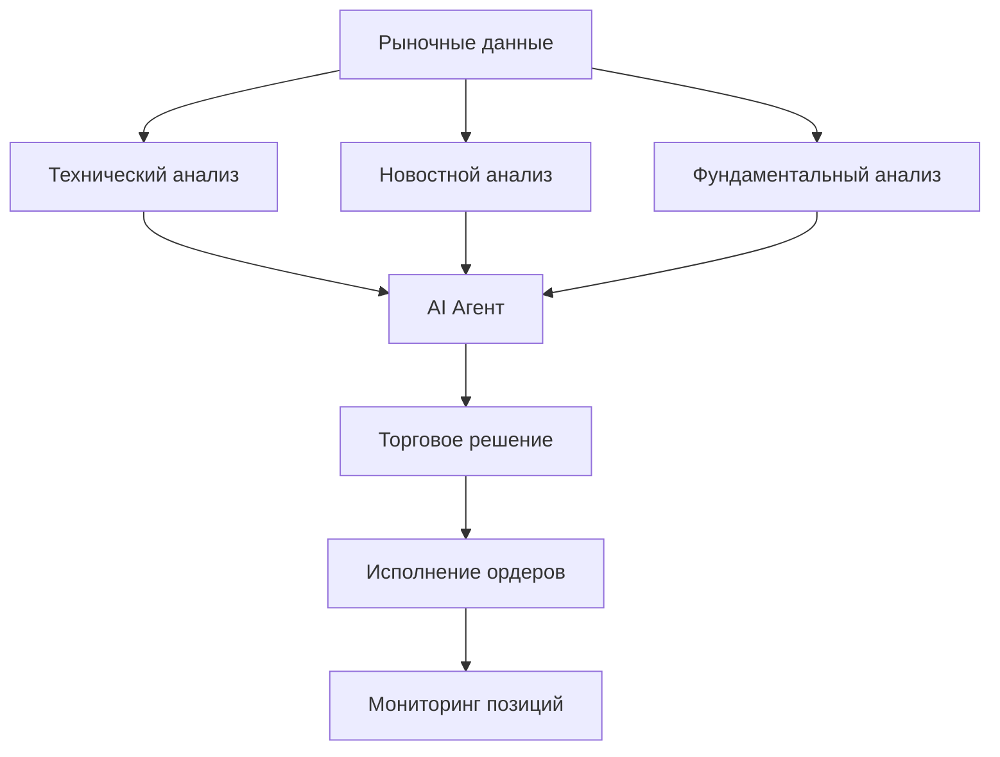

# Что такое AI Trade Bot?

AI Trade Bot — это автоматизированная торговая система, которая использует искусственный интеллект для анализа рынка и принятия торговых решений.

## Основные возможности

### 🧠 AI-анализ рынка

Система сочетает три типа анализа:

1. **Технический анализ**
   - RSI (Relative Strength Index)
   - MACD (Moving Average Convergence Divergence)
   - Bollinger Bands
   - Уровни поддержки и сопротивления

2. **Новостной анализ**
   - LLM-анализ тональности (Ollama/qwen3)
   - Выделение ключевых событий
   - Определение рисков и возможностей

3. **Фундаментальный анализ**
   - Мультипликаторы (P/E, P/B, EV/EBITDA)
   - Рентабельность (ROE, ROA, маржинальность)
   - Финансовое здоровье (D/E, Current Ratio)
   - Темпы роста (выручка, прибыль)

### 📈 Торговые стратегии

| Стратегия | Описание | Когда использовать |
|-----------|----------|-------------------|
| **Grid** | Сетка ордеров на покупку/продажу | Боковой тренд (флэт) |
| **Interval** | Торговля по временным интервалам | Любые рыночные условия |
| **Momentum** | Следование за трендом | Сильный тренд |
| **Mean Reversion** | Возврат к среднему | После сильных отклонений |

### 🛡️ Управление рисками

- Расчет размера позиции от баланса
- Stop Loss для ограничения убытков
- Take Profit для фиксации прибыли
- Лимиты на максимальную позицию
- Резервирование баланса

## Как это работает



## Архитектура

```
┌─────────────────────────────────────────────────────┐
│                 AI Trade Bot                        │
├─────────────────────────────────────────────────────┤
│  ┌─────────────┐  ┌─────────────┐  ┌─────────────┐ │
│  │   Market    │  │   News      │  │  Fundamental│ │
│  │   Data      │  │   Analyzer  │  │  Analyzer   │ │
│  └──────┬──────┘  └──────┬──────┘  └──────┬──────┘ │
│         │                │                │         │
│         └────────────────┼────────────────┘         │
│                          │                          │
│                  ┌───────▼────────┐                │
│                  │  Trading Agent │                │
│                  │     (LLM)      │                │
│                  └───────┬────────┘                │
│                          │                          │
│         ┌────────────────┼────────────────┐        │
│         │                │                │         │
│  ┌──────▼──────┐  ┌──────▼──────┐  ┌────▼──────┐  │
│  │   Grid      │  │  Interval   │  │ Momentum  │  │
│  │   Bot       │  │  Strategy   │  │ Strategy  │  │
│  └──────┬──────┘  └──────┬──────┘  └────┬──────┘  │
│         │                │               │         │
│         └────────────────┼───────────────┘         │
│                          │                          │
│                  ┌───────▼────────┐                │
│                  │ Order Executor │                │
│                  └───────┬────────┘                │
│                          │                          │
│                  ┌───────▼────────┐                │
│                  │  Tinkoff API   │                │
│                  └────────────────┘                │
└─────────────────────────────────────────────────────┘
```

## Требования

### Минимальные

- Rust 1.70+
- 2 GB RAM
- 1 GB дискового пространства
- Tinkoff Invest токен

### Рекомендуемые

- Rust 1.75+
- 4 GB RAM
- Docker (для Ollama)
- GPU (для ускорения LLM)

## Следующие шаги

- **[Быстрый старт](quickstart.md)** — Установка и запуск
- **[Конфигурация](../user-guide/configuration.md)** — Настройка бота
- **[Стратегии](../strategies/grid-bot.md)** — Выбор стратегии
